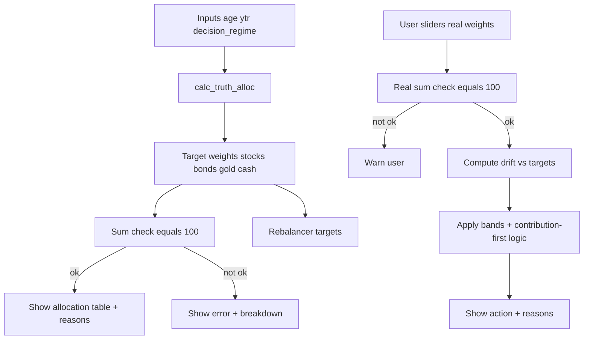

# Plan: Fix Tilt / Allocation Sum Bugs + Add Explainability

## What I see in the current code (root cause hypothesis)

In [`truthasset.py`](truthasset.py:377), `calc_truth_alloc()` currently does:

- Sets `gold = 5.0` (fixed).
- Computes a base stock (`b_stk`) and a `defense_total`.
- Computes `b_bnd` and `b_csh` like this:
  - `b_bnd = max(0, defense_total - base_cash)`
  - `b_csh = max(0, defense_total - b_bnd)`

This forces `b_csh` to equal `base_cash` (because `defense_total - (defense_total - base_cash) == base_cash`). So base cash is always 5% when `ytr>0`, and 0% when retired. That part is OK.

Then it applies tilt to stocks and recomputes defense as:

- `stk_f = clamp(b_stk + tilt, 0..100)`
- `defense_after = 95 - stk_f`
- `bnd_f = max(0, defense_after - gold - b_csh)`
- `csh_f = b_csh`

This is the bug: `defense_after` already represents the *entire* non-stock bucket within the 95% pool (because gold is fixed separately at 5%). Subtracting `gold` again double-subtracts gold.

So the returned total becomes:

- `stk_f + bnd_f + gold + csh_f = stk_f + (defense_after - gold - b_csh) + gold + b_csh = stk_f + defense_after = 95`

That explains the user-observed symptom: allocations won’t sum to 100 (they’ll gravitate to ~95, with small rounding variations).

The “2.1% bond while FTD unconfirmed” symptom is likely a *separate* issue:

- The allocation engine does not directly use FTD confirmation; it uses `decision_regime` and `bond_protection_on`.
- A small bond allocation can appear when:
  - `decision_regime` resolves to Normal/Caution (not Crisis), and
  - the computed defense residual assigns some amount to bonds after fixed gold/cash.

So if the user expected “FTD unconfirmed => no bonds”, that expectation isn’t currently encoded. Per your latest spec, FTD should influence *invest gating* and *regime forcing to Caution* via the guard, not directly kill bonds.

## Correct invariants (what must always be true)

For targets:

- `gold` is fixed at 5.
- `stocks + bonds + cash = 95`.
- Total must be: `stocks + bonds + gold + cash = 100`.

For explainability:

- The app should show both:
  - the computed target mix and its sum check
  - the user-entered real mix (sliders) and its sum check

No auto-normalization: only warn and explain.

## Planned code changes

### 1) Fix `calc_truth_alloc()` math to always sum to 100

In [`truthasset.py`](truthasset.py:377):

- Keep `gold = 5.0` fixed.
- After computing `stk_f`, compute `defense_after = 95 - stk_f`.
- Allocate defense between cash and bonds without subtracting gold.
  - `csh_f = min(b_csh, defense_after)` (cash base capped by available defense)
  - `bnd_f = max(0, defense_after - csh_f)`
- Apply bond protection:
  - if on: `csh_f += bnd_f; bnd_f = 0`

This guarantees sums:

- `stk_f + bnd_f + csh_f = 95`
- `+ gold = 100`

Edge handling:

- If extreme tilt makes `stk_f` close to 95, then defense is tiny; cash gets capped, bond becomes 0.

### 2) Prevent tiny unintended bond allocations when constraints suggest otherwise

Once sums are correct, small bond percentages may still legitimately occur when defense is small.

To avoid confusing “2.1% bonds” outputs, add a display rule (NOT a math hack):

- If `bnd_f < 0.5%`, display it as `0.0%` and roll the remainder into cash for *display only* OR show as `≈0%`.

However: since you asked not to normalize or silently change numbers, the cleaner approach is:

- Keep numbers exact.
- Add an explanation line:
  - “Bond is small because: Defense bucket is small (95 - stocks), cash base is fixed, residual leaves only X% bonds.”

Optionally add a config threshold constant later, but default can be no threshold.

### 3) Add explainability outputs in Layer 2 (allocation section)

In [`truthasset.py`](truthasset.py:660) (Layer 2 expander/table area), add:

- A computed sum line:
  - `target_sum = stk_p + bnd_p + gld_p + csh_p`
  - If not close to 100 (e.g. abs(diff) > 0.05), show `st.error` with breakdown.
  - Otherwise show `st.caption` that it sums to 100.

- A “Why this tilt” section:
  - Inputs: `decision_regime`, `age_compression`, `tilt_used`
  - Rule text: tilt depends only on regime + age

- A “Why bonds/cash are X%” section:
  - Show: `defense_after = 95 - stk_p`, base cash `b_csh_v`, residual to bond.

### 4) Add warnings in the rebalancing simulator when slider totals != 100

In [`truthasset.py`](truthasset.py:893):

- Compute `real_sum = real_stock + real_bond + real_gold + real_cash`.
- If abs(real_sum - 100) > 0.1:
  - `st.warning` explaining:
    - triggers/deviations are computed vs target, but the inputs don’t represent a full portfolio
    - user should adjust sliders to sum to 100 for meaningful actions

Also compute and display:

- target sum check (should be 100 after math fix)

### 5) Add a compact “Reasons” column to the rebalancing table

In the `rebalance_rows` creation in [`truthasset.py`](truthasset.py:926):

Add a `reasons` string assembled from:

- Band used (`STOCK_REBALANCE_BAND`, etc.)
- Drift and sign
- Whether accumulation_mode is true
- Whether vix_delay is on
- Whether mode is Crisis Override

This makes it self-explanatory why the trigger fired.

## Mermaid: Allocation and Rebalancing Explainability Flow

## Approval checklist (what I need from you)

- Confirm you want to keep the allocation model structure: `gold fixed 5`, `stocks vary by glidepath + tilt`, `cash fixed base (0 or 5)`, `bonds are residual defense (unless bond protection swaps to cash)`.
- Confirm you do NOT want any special rule like “FTD unconfirmed implies bonds must be 0”.

Once you approve this plan, I will switch to Code mode to implement the fixes and the added explanations in [`truthasset.py`](truthasset.py:1).
